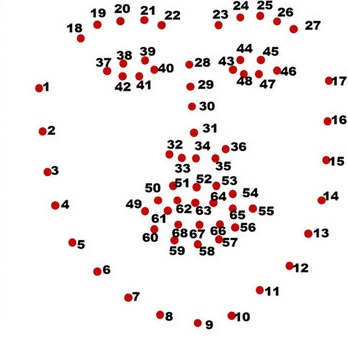
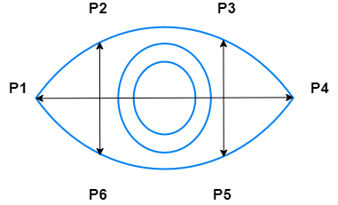
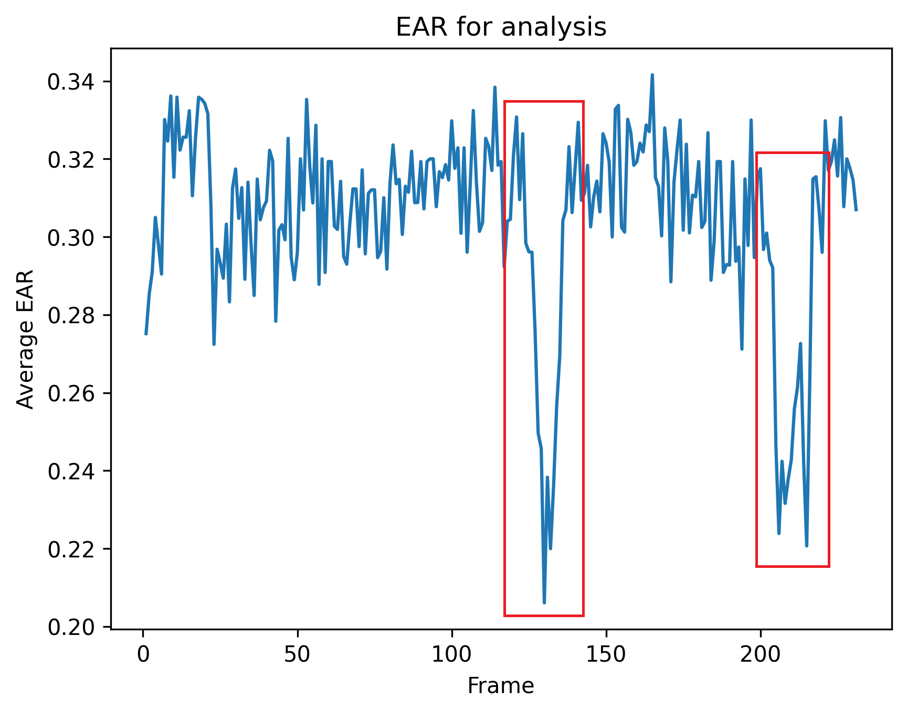

# Detección del sueño del conductor
Un proyecto basado en Visión por Computador para comprobar si el conductor de un vehículo tiene sueño.

# Acerca del proyecto

La idea principal de este proyecto es proteger a los conductores que viajan largas distancias, especialmente durante la noche, y son propensos a sentir sueño.

El proyecto se puede implementar en una Raspberry Pi y se puede instalar junto con una cámara en el tablero del automóvil. El sistema comprobará automáticamente si la persona tiene sueño y hará sonar una alarma cuando parezca tener sueño.

El proyecto comprueba dos cosas:

1. Si los ojos de la persona están cerrados continuamente, entonces la persona ha dormido (o tiene mucho sueño) y se envía una ALERTA ya que esto es crítico.

2. Si la persona bosteza más de un número de veces durante un tiempo determinado, eso significa que tiene mucho sueño y se envía una ADVERTENCIA.

La primera parte del proyecto está inspirada en este [enlace](https://pyimagesearch.com/2017/05/08/drowsiness-detection-opencv/).

# Funcionamiento del proyecto

## Parte 1: detector de sueño

1. El primer paso es detectar si un rostro puede ser identificado usando la librería [dlib](http://dlib.net/).

2. Una vez que se encuentra una cara, se seleccionan las coordenadas del ojo. Las coordenadas de la cara se muestran en la [imagen](https://www.researchgate.net/publication/343699139_A_framework_for_facial_age_progression_and_regression_using_exemplar_face_templates) de abajo. 
    
    

3. Una vez identificados los ojos, la relación de aspecto del ojo (EAR) para cada ojo se calcula utilizando la ecuación que se muestra a continuación.
   
   

    

4. Se toma el EAR promedio de ambos ojos.

5. Si el promedio EAR de ambos ojos cae por debajo de un umbral durante un número determinado de cuadros consecutivos, entonces suena la alarma y se puede despertar al conductor.

6. Un experimento sencillo puede encontrar el umbral de cada conductor/persona.
    1. Simplemente ejecute el programa principal usando el comando `python main.py`.
    2. Pídale a la persona que mantenga los ojos abiertos durante un tiempo y luego parpadee rápidamente, luego pídale que los mantenga abiertos y luego un parpadeo más grande.
    3. Luego detenga el programa presionando la tecla `q`.
    4. Abra el archivo `Graphs\EAR.png`.
    5. Puede ver el EAR visualizado en el marco de este gráfico y, a partir de ahí, puede identificar y establecer el umbral_EAR.
    6. Modifique esto en `config.json`.
    7. En la siguiente imagen se muestra un gráfico de muestra. El bloque rojo representa un evento de parpadeo.
   
    

## Parte 2: Detector de bostezos

7. De manera similar el detector de bostezos también funciona y envía nuestros AVISOS. Los parámetros se pueden ajustar en `config.json`.

8. El detector de bostezos básicamente verifica si una persona bosteza y si el bostezo se detecta en función de si MAR excede el "MAR_threshold".

9. Si hay más de un número definido de bostezos `number_of_yawns` en un número específico de fotogramas (definido por `number_of_frames_yawns`), entonces suena una ALARMA.

10. De forma similar a la definida en el punto 6, los umbrales podrán detectarse y establecerse.

# Requisitos previos para Windows

1. Instale [CMake](https://cmake.org/download/): Dado que dlib está basado en C, se requiere CMake para la compilación. Además, agregue CMake a sus variables de entorno.

2. Instale Visual Studio [here](https://visualstudio.microsoft.com/visual-cpp-build-tools/): Instale también paquetes de paquetes adicionales `Herramientas CMake para Windows`.

# Run the Code

1. Se recomienda utilizar un entorno virtual. 

2. Descarga los modelos dblib para detección de rostros [aqui](http://dlib.net/files/shape_predictor_68_face_landmarks.dat.bz2).

3. Instale los requirements.txt usando `pip install -r requirements.txt`

4. Para probar o ejecutar el código, ejecute el comando `python main.py`
   
# Información adicional

## Versión de Python

Todo el proyecto está desarrollado con la versión de Python `Python 3.11.4` y la versión de pip `pip 24.0`.

